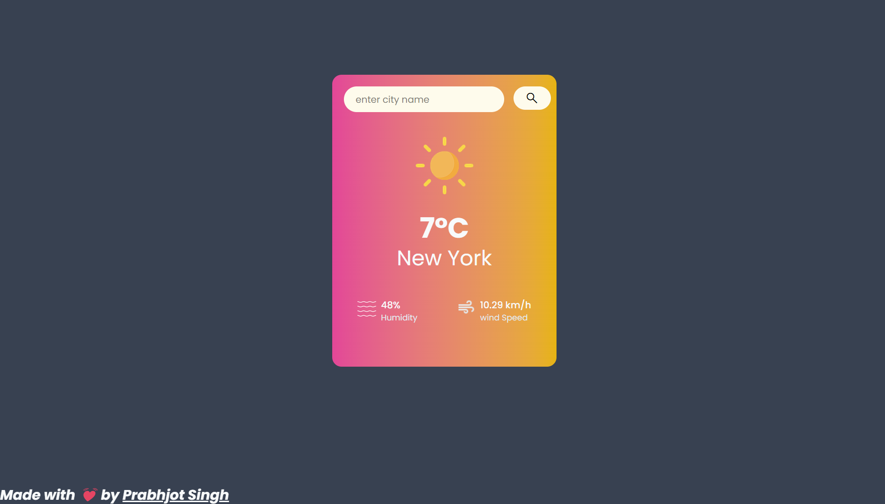

# 🌦️ Weather-Glance  
**project-link** - https://statuesque-cranachan-c8b738.netlify.app
--
**Weather-Glance** is a sleek and responsive weather app built with **HTML, Tailwind CSS, and JavaScript**, providing real-time weather updates at a glance! ☀️🌧️🌍  

## 🚀 Features  
✅ **Real-time Weather Data** – Fetches live weather updates 📡  
✅ **Minimal & Responsive UI** – Built with **Tailwind CSS** 🎨  
✅ **Fast & Lightweight** – Optimized for performance ⚡  
✅ **Search by City** – Get weather details for any location 🌍  

## 📸 Preview  
  

## 🛠️ Tech Stack  
- **HTML** – Structure the app  
- **Tailwind CSS** – Beautiful styling  
- **JavaScript** – Fetch & display weather data  
- **Weather API** – Get real-time weather info  

## 🔧 Setup & Installation  
1. **Clone the repo**  
   ```bash
   git clone https://github.com/PrabhjotSinghUbhi/weather-glance.git
   cd weather-glance
